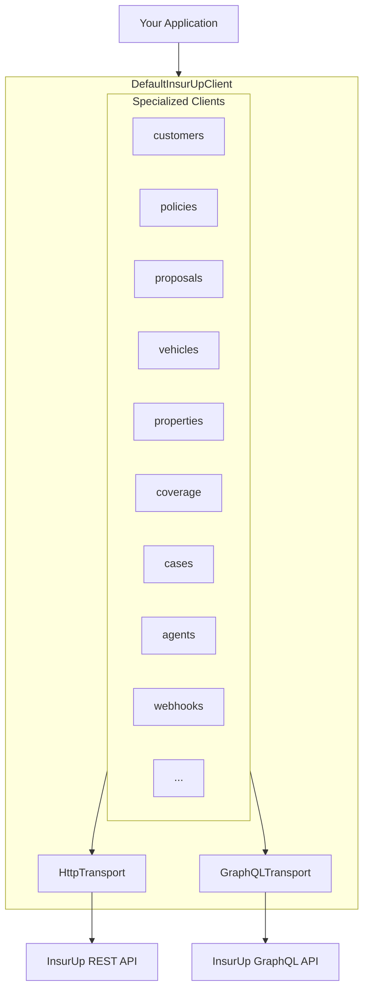

# InsurUp TypeScript SDK

[](https://www.npmjs.com/package/@insurup/sdk)
[](https://www.typescriptlang.org/)
[](https://opensource.org/licenses/MIT)
[](package.json)

Type-safe TypeScript SDK for the InsurUp insurance platform with GraphQL support. Zero dependencies, tree-shakeable, works everywhere.

---

## Table of Contents

- [Installation](#installation)
- [Quick Start](#quick-start)
- [Authentication](#authentication)
- [Architecture](#architecture)
- [Result Handling](#result-handling)
- [GraphQL Queries](#graphql-queries)
- [Configuration](#configuration)
- [Interceptors](#interceptors)
- [API Clients](#api-clients)
- [Compatibility](#compatibility)
- [License](#license)

---

## Installation

```bash
npm install @insurup/sdk
```

```bash
pnpm add @insurup/sdk
```

```bash
yarn add @insurup/sdk
```

---

## Quick Start

```typescript
import { DefaultInsurUpClient } from '@insurup/sdk';

const client = new DefaultInsurUpClient({
  tokenProvider: () => getAccessToken(),
});

const result = await client.customers.getCustomer('customer-id');

if (result.isSuccess) {
  console.log(result.data);
}
```

---

## Authentication

The SDK ships an auth module for OAuth 2.0 / OIDC login, token storage, and transparent refresh. `createInsurUpAuth()` returns an `InsurUpAuth` handle; pass it to the client as `auth` and tokens are injected into every HTTP and SignalR request automatically.

```typescript
import { createInsurUpAuth, DefaultInsurUpClient } from '@insurup/sdk';

const auth = createInsurUpAuth({ clientId, clientSecret });
await auth.loginWithClientCredentials();

const client = new DefaultInsurUpClient({ auth }); // tokens flow automatically
```

Passing `auth` wires `auth.tokenProvider` into the client. An explicit `tokenProvider` always takes precedence, so you can still bring your own tokens.

### Client credentials (server-to-server)

For backend services and scripts. Requires a `clientSecret` — **never ship a secret to a browser.**

```typescript
const auth = createInsurUpAuth({
  clientId: process.env.INSURUP_CLIENT_ID!,
  clientSecret: process.env.INSURUP_CLIENT_SECRET!,
  scopes: ['core-api'],
});

await auth.loginWithClientCredentials();
// or override per call: auth.loginWithClientCredentials({ scopes: ['core-api', 'reports'] })

const client = new DefaultInsurUpClient({ auth });
```

> The client credentials grant does not issue a refresh token. When the access token expires the session is cleared and `getAccessToken()` returns `null` — call `loginWithClientCredentials()` again to acquire a fresh one. See [Token lifecycle](#token-lifecycle).

### Authorization code + PKCE (browser / public clients)

No client secret. Redirect the user to the authorization server, then exchange the returned code.

```typescript
const auth = createInsurUpAuth({
  clientId: 'spa-client',
  authServer: 'https://auth.insurup.com', // endpoints resolved via OIDC discovery
  storage: localStorageTokenStorage(), // persist across reloads (see Token storage)
});

// 1. Build the authorize URL and send the user there
const { url, codeVerifier, state } = await auth.getAuthorizeUrl({
  redirectUri: 'https://app.example.com/callback',
  scopes: ['openid', 'offline_access', 'core-api'], // offline_access → refresh token
});
sessionStorage.setItem('insurup.pkce', JSON.stringify({ codeVerifier, state }));
window.location.assign(url);

// 2. On the callback page, exchange the code for tokens
const { codeVerifier, state } = JSON.parse(sessionStorage.getItem('insurup.pkce')!);
await auth.exchangeCode({
  callbackUrl: window.location.href, // ?code & ?state are parsed out of it
  redirectUri: 'https://app.example.com/callback',
  codeVerifier,
  state,
});

const client = new DefaultInsurUpClient({ auth });
```

### Token storage

By default tokens are held in memory and lost on restart/reload. Provide a `TokenStorage` (`get` / `set` / `clear`, sync or async) to persist them — e.g. browser `localStorage`:

```typescript
import type { TokenStorage, OAuthTokens } from '@insurup/sdk';

function localStorageTokenStorage(key = 'insurup.tokens'): TokenStorage {
  return {
    get: () => {
      const raw = localStorage.getItem(key);
      return raw ? (JSON.parse(raw) as OAuthTokens) : null;
    },
    set: (tokens) => localStorage.setItem(key, JSON.stringify(tokens)),
    clear: () => localStorage.removeItem(key),
  };
}
```

The same shape works for a keychain, an encrypted file, or an edge KV store. The in-memory default is also exported as `createMemoryTokenStorage()`.

> **Serverless / edge:** in-memory storage does not survive between invocations (each request may run in a fresh isolate), so tokens are re-fetched every time. Back `TokenStorage` with a shared store (KV, Durable Object, Redis, cookie) to persist sessions across requests.

### Token lifecycle

Refresh is automatic — `tokenProvider` calls `getAccessToken()`, which refreshes when the token is within `refreshBufferSeconds` (default **60s**) of expiry, de-duping concurrent refreshes into a single request. You rarely need these directly:

```typescript
await auth.getAccessToken(); // valid token (refreshing if needed) or null
await auth.refresh(); // force a refresh; rejects if no refresh token
await auth.getTokens(); // raw stored tokens (may be expired) or null
await auth.logout(); // clear the session
auth.getState(); // sync { isAuthenticated, tokens }
```

If a refresh fails — or an access token expires with no refresh token available — the session is cleared and `getAccessToken()` returns `null`.

### Reactive state

`subscribe` + `getState` plug straight into `useSyncExternalStore` (React) or a store (Vue/Svelte):

```typescript
const unsubscribe = auth.subscribe((state) => {
  render(state.isAuthenticated ? 'Signed in' : 'Signed out');
});
```

### Error handling

Login and refresh failures are normalized to a typed `OAuthError`:

```typescript
import { OAuthError } from '@insurup/sdk';

try {
  await auth.loginWithClientCredentials();
} catch (err) {
  if (err instanceof OAuthError) {
    console.error(err.code, err.description, err.status); // e.g. 'invalid_client', …, 401
  }
}
```

### Runtime support

The auth module imports no Node built-ins — it runs on any platform with the Fetch API and Web Crypto (`crypto.subtle`): Node 18+, Bun, Deno, modern browsers, and edge runtimes (Cloudflare Workers, Vercel Edge). On stateless runtimes, supply a persistent `TokenStorage` (see [Token storage](#token-storage)).

---

## Architecture



The SDK uses a **compositional architecture**:

- `DefaultInsurUpClient` aggregates 18 specialized clients
- All clients share `HttpTransport` and `GraphQLTransport` instances
- GraphQL queries support filtering, searching, sorting, and type-safe field selection
- Request/response interceptors hook into the transport layer
- Results use discriminated unions for type-safe error handling

---

## Result Handling

Every API call returns an `InsurUpResult<T>` — a discriminated union that's either a success or an error:

```typescript
const result = await client.customers.getCustomer('id');

// Pattern 1: Boolean check
if (result.isSuccess) {
  console.log(result.data); // fully typed
} else {
  console.error(result.message);
}

// Pattern 2: Switch on kind
switch (result.kind) {
  case 'success':
    return result.data;
  case 'server-error':
    throw new Error(`${result.type}: ${result.message}`);
  case 'client-error':
    throw new Error(`Network error: ${result.message}`);
}

// Pattern 3: Throw on error
import { getDataOrThrow } from '@insurup/sdk';

const customer = getDataOrThrow(await client.customers.getCustomer('id'));
```

### Error Types

| Kind           | Types                                                                                                   |
| -------------- | ------------------------------------------------------------------------------------------------------- |
| `server-error` | `Unauthorized`, `AccessDenied`, `ResourceNotFound`, `InputValidation`, `BusinessValidation`, `Upstream` |
| `client-error` | `Timeout`, `HttpRequestFailed`, `JsonDeserialization`, `NullResponse`                                   |

---

## GraphQL Queries

The SDK includes built-in GraphQL support for querying entities with advanced filtering, searching, sorting, and type-safe field selection.

### Available GraphQL Methods

| Client       | Method                     | Description                       |
| ------------ | -------------------------- | --------------------------------- |
| `customers`  | `getCustomers()`           | Query customers with filters      |
| `policies`   | `getPolicies()`            | Query policies with filters       |
| `policies`   | `getPolicyTransfers()`     | Query policy transfers            |
| `policies`   | `getFilePolicyTransfers()` | Query file-based policy transfers |
| `proposals`  | `getProposals()`           | Query proposals with filters      |
| `cases`      | `getCases()`               | Query cases with filters          |
| `agentUsers` | `getAgentUsers()`          | Query agent users with filters    |
| `webhooks`   | `getWebhookDeliveries()`   | Query webhook deliveries          |

### Basic Usage

```typescript
// Query with pagination
const result = await client.customers.getCustomers({
  first: 10,
  after: 'cursor-string',
});

if (result.isSuccess) {
  console.log(result.data.nodes); // Customer[]
  console.log(result.data.totalCount); // Total count
  console.log(result.data.pageInfo); // Pagination info
}
```

### Type-Safe Field Selection

Select only the fields you need — the return type automatically narrows:

```typescript
const result = await client.policies.getPolicies({
  select: ['id', 'productBranch', 'grossPremium', 'state'] as const,
  first: 10,
});

// result.data.nodes[0] is typed as:
// { id: string; productBranch: ProductBranch; grossPremium: number | null; state: PolicyState }
```

### Filtering and Searching (unified)

Every list query takes a single `filter:` field carrying the **unified** input shape. Each per-field entry is either a plain filter operator or, with a `$search: true` marker, a search clause. The SDK splits the unified input into the server's `filter:` and `search:` slots at request time.

Operator names match the wire (`notContains`, `notStartsWith`, `notEndsWith`). Search-side text ops (`textSearch`, `wildcard`, `autocomplete`, etc.) take both `string` shorthand and `{ value, score? }` long form; `in`/`nin` take `string[]` shorthand or `{ values, score? }`.

```typescript
import { CustomerType, ProductBranch } from '@insurup/sdk';

// 1. Pure filter — every entry without `$search: true` routes to the wire filter slot
const filtered = await client.policies.getPolicies({
  first: 20,
  filter: {
    productBranch: { eq: ProductBranch.Traffic },
    grossPremium: { gte: 1000 },
    insuredCustomerName: { notContains: 'TEST' },
  },
});

// 2. Pure search — `$search: true` promotes a field, unlocking search-only operators
const searched = await client.customers.getCustomers({
  first: 10,
  filter: {
    // Shorthand string — SDK normalizes to { value: 'John' }
    name: { $search: true, textSearch: 'John' },
  },
});

// 3. Mixed — splits across both wire slots in one call
const both = await client.customers.getCustomers({
  first: 20,
  filter: {
    type: { eq: CustomerType.Individual }, // → wire `filter:`
    name: { $search: true, textSearch: 'John' }, // → wire `search:`
    identityNumber: { $search: true, in: ['123', '456'] }, // → wire `search:` (string[] shorthand)
  },
});

// 4. Relevance score boost / constant — long-form SearchTextInput
const boosted = await client.customers.getCustomers({
  first: 10,
  filter: {
    name: { $search: true, textSearch: { value: 'John', score: { boost: 2 } } },
    primaryEmail: { $search: true, contains: { value: '@acme.com', score: { constant: 5 } } },
  },
});

// 5. Combinators — and/or recursively
const compound = await client.customers.getCustomers({
  first: 20,
  filter: {
    and: [
      { type: { eq: CustomerType.Individual } },
      { name: { $search: true, textSearch: 'John' } },
    ],
  },
});
```

The `$search` marker is type-checked: it's only allowed on fields the server actually exposes as searchable. Marking a filter-only field is a compile error, as is using a search-only operator (like `textSearch`) without the marker.

> If you're consuming the **table adapter** (`@insurup/table-adapter-core`), `setFilter` takes the exact same unified shape. The adapter forwards it to the SDK as-is; the SDK does the split.

### Sorting

```typescript
import { SortEnumType } from '@insurup/sdk';

const result = await client.cases.getCases({
  first: 20,
  order: [{ priorityScore: SortEnumType.Desc }, { createdAt: SortEnumType.Desc }],
});
```

---

## Configuration

```typescript
const client = new DefaultInsurUpClient({
  baseUrl: 'https://api.insurup.com/api/',
  tokenProvider: () => getAccessToken(),
  timeoutMs: 30000,
  customHeaders: { 'X-Request-Source': 'my-app' },
  retry: { retries: 3, backoffStrategy: 'exponential' },
  onRequest: (config) => config,
  onResponse: (result, config) => result,
});
```

| Option          | Type                              | Default                        | Description              |
| --------------- | --------------------------------- | ------------------------------ | ------------------------ |
| `baseUrl`       | `string`                          | `https://api.insurup.com/api/` | API base URL             |
| `tokenProvider` | `() => string \| Promise<string>` | —                              | OAuth token provider     |
| `timeoutMs`     | `number`                          | `30000`                        | Request timeout          |
| `customHeaders` | `Record<string, string>`          | —                              | Headers for all requests |
| `retry`         | `RetryOptions`                    | —                              | Retry configuration      |
| `onRequest`     | `RequestInterceptor`              | —                              | Pre-request hook         |
| `onResponse`    | `ResponseInterceptor`             | —                              | Post-response hook       |

---

## Interceptors

Add logging, correlation IDs, or transform requests/responses:

```typescript
const client = new DefaultInsurUpClient({
  tokenProvider: () => token,

  onRequest: (config) => {
    console.log(`→ ${config.method} ${config.url}`);
    return {
      ...config,
      headers: { ...config.headers, 'X-Correlation-ID': crypto.randomUUID() },
    };
  },

  onResponse: (result, config) => {
    console.log(`← ${config.url} ${result.isSuccess ? '✓' : '✗'}`);
    return result;
  },
});
```

---

## API Clients

Access specialized clients through the main client instance:

| Client                 | Description                                  |
| ---------------------- | -------------------------------------------- |
| `client.customers`     | Customer profiles, contact info, health data |
| `client.policies`      | Policy details, documents, representatives   |
| `client.proposals`     | Insurance proposals, comparisons, purchasing |
| `client.vehicles`      | Vehicle data, brand/model lookups            |
| `client.properties`    | Property data, DASK earthquake insurance     |
| `client.coverage`      | Coverage configuration, coverage groups      |
| `client.cases`         | Service requests, claims, complaints         |
| `client.agents`        | Agent profiles, company connections          |
| `client.agentBranches` | Branch management                            |
| `client.agentRoles`    | Role-based access control                    |
| `client.agentUsers`    | Agency staff management                      |
| `client.agentSetup`    | Agent onboarding                             |
| `client.webhooks`      | Event notifications, integrations            |
| `client.oauthClients`  | OAuth client management, redirect URIs       |
| `client.insurance`     | Companies, products, resource keys           |
| `client.files`         | File uploads and management                  |
| `client.languages`     | Localization support                         |
| `client.templates`     | Document and email templates                 |

---

## Compatibility

| Environment | Support                                       |
| ----------- | --------------------------------------------- |
| Node.js     | 18+                                           |
| Browsers    | ES2022+ (Chrome 94+, Firefox 93+, Safari 15+) |
| Bun         | ✓                                             |
| Deno        | ✓                                             |

Dual ESM/CJS builds included. Full tree-shaking support.

---

## License

[MIT](LICENSE)
