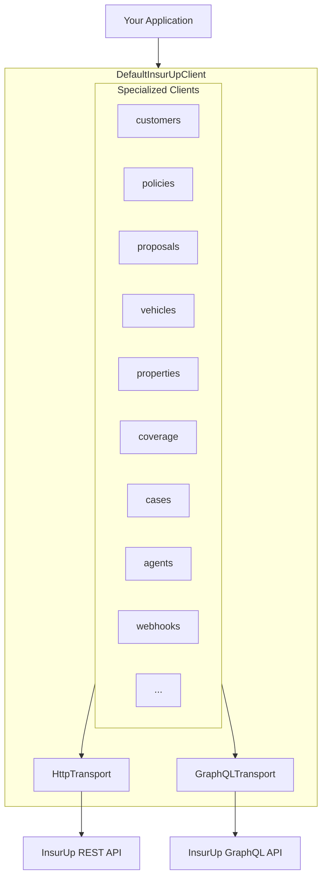

# InsurUp TypeScript SDK

[](https://www.npmjs.com/package/@insurup/sdk)
[](https://www.typescriptlang.org/)
[](https://opensource.org/licenses/MIT)
[](package.json)

Type-safe TypeScript SDK for the InsurUp insurance platform with GraphQL support. Zero dependencies, tree-shakeable, works everywhere.

---

## Table of Contents

- [Installation](#installation)
- [Quick Start](#quick-start)
- [Architecture](#architecture)
- [Result Handling](#result-handling)
- [GraphQL Queries](#graphql-queries)
- [Configuration](#configuration)
- [Interceptors](#interceptors)
- [API Clients](#api-clients)
- [Compatibility](#compatibility)
- [License](#license)

---

## Installation

```bash
npm install @insurup/sdk
```

```bash
pnpm add @insurup/sdk
```

```bash
yarn add @insurup/sdk
```

---

## Quick Start

```typescript
import { DefaultInsurUpClient } from '@insurup/sdk';

const client = new DefaultInsurUpClient({
  tokenProvider: () => getAccessToken(),
});

const result = await client.customers.getCustomer('customer-id');

if (result.isSuccess) {
  console.log(result.data);
}
```

---

## Architecture



The SDK uses a **compositional architecture**:

- `DefaultInsurUpClient` aggregates 17 specialized clients
- All clients share `HttpTransport` and `GraphQLTransport` instances
- GraphQL queries support filtering, searching, sorting, and type-safe field selection
- Request/response interceptors hook into the transport layer
- Results use discriminated unions for type-safe error handling

---

## Result Handling

Every API call returns an `InsurUpResult<T>` — a discriminated union that's either a success or an error:

```typescript
const result = await client.customers.getCustomer('id');

// Pattern 1: Boolean check
if (result.isSuccess) {
  console.log(result.data); // fully typed
} else {
  console.error(result.message);
}

// Pattern 2: Switch on kind
switch (result.kind) {
  case 'success':
    return result.data;
  case 'server-error':
    throw new Error(`${result.type}: ${result.message}`);
  case 'client-error':
    throw new Error(`Network error: ${result.message}`);
}

// Pattern 3: Throw on error
import { getDataOrThrow } from '@insurup/sdk';

const customer = getDataOrThrow(await client.customers.getCustomer('id'));
```

### Error Types

| Kind           | Types                                                                                                   |
| -------------- | ------------------------------------------------------------------------------------------------------- |
| `server-error` | `Unauthorized`, `AccessDenied`, `ResourceNotFound`, `InputValidation`, `BusinessValidation`, `Upstream` |
| `client-error` | `Timeout`, `HttpRequestFailed`, `JsonDeserialization`, `NullResponse`                                   |

---

## GraphQL Queries

The SDK includes built-in GraphQL support for querying entities with advanced filtering, searching, sorting, and type-safe field selection.

### Available GraphQL Methods

| Client       | Method                     | Description                       |
| ------------ | -------------------------- | --------------------------------- |
| `customers`  | `getCustomers()`           | Query customers with filters      |
| `policies`   | `getPolicies()`            | Query policies with filters       |
| `policies`   | `getPolicyTransfers()`     | Query policy transfers            |
| `policies`   | `getFilePolicyTransfers()` | Query file-based policy transfers |
| `proposals`  | `getProposals()`           | Query proposals with filters      |
| `cases`      | `getCases()`               | Query cases with filters          |
| `agentUsers` | `getAgentUsers()`          | Query agent users with filters    |
| `webhooks`   | `getWebhookDeliveries()`   | Query webhook deliveries          |

### Basic Usage

```typescript
// Query with pagination
const result = await client.customers.getCustomers({
  first: 10,
  after: 'cursor-string',
});

if (result.isSuccess) {
  console.log(result.data.nodes); // Customer[]
  console.log(result.data.totalCount); // Total count
  console.log(result.data.pageInfo); // Pagination info
}
```

### Type-Safe Field Selection

Select only the fields you need — the return type automatically narrows:

```typescript
const result = await client.policies.getPolicies({
  select: ['id', 'productBranch', 'grossPremium', 'state'] as const,
  first: 10,
});

// result.data.nodes[0] is typed as:
// { id: string; productBranch: ProductBranch; grossPremium: number | null; state: PolicyState }
```

### Filtering

```typescript
import { ProductBranch, PolicyState } from '@insurup/sdk';

const result = await client.policies.getPolicies({
  first: 20,
  filter: {
    productBranch: { eq: ProductBranch.Traffic },
    state: { eq: PolicyState.Active },
    grossPremium: { gte: 1000 },
  },
});
```

### Searching

Full-text search with score boosting:

```typescript
const result = await client.customers.getCustomers({
  first: 10,
  search: {
    name: {
      text: { value: 'John' },
      score: { boost: 2 },
    },
  },
});
```

### Sorting

```typescript
import { SortEnumType } from '@insurup/sdk';

const result = await client.cases.getCases({
  first: 20,
  order: [{ priorityScore: SortEnumType.Desc }, { createdAt: SortEnumType.Desc }],
});
```

---

## Configuration

```typescript
const client = new DefaultInsurUpClient({
  baseUrl: 'https://api.insurup.com/api/',
  tokenProvider: () => getAccessToken(),
  timeoutMs: 30000,
  customHeaders: { 'X-Request-Source': 'my-app' },
  retry: { retries: 3, backoffStrategy: 'exponential' },
  onRequest: (config) => config,
  onResponse: (result, config) => result,
});
```

| Option          | Type                              | Default                        | Description              |
| --------------- | --------------------------------- | ------------------------------ | ------------------------ |
| `baseUrl`       | `string`                          | `https://api.insurup.com/api/` | API base URL             |
| `tokenProvider` | `() => string \| Promise<string>` | —                              | OAuth token provider     |
| `timeoutMs`     | `number`                          | `30000`                        | Request timeout          |
| `customHeaders` | `Record<string, string>`          | —                              | Headers for all requests |
| `retry`         | `RetryOptions`                    | —                              | Retry configuration      |
| `onRequest`     | `RequestInterceptor`              | —                              | Pre-request hook         |
| `onResponse`    | `ResponseInterceptor`             | —                              | Post-response hook       |

---

## Interceptors

Add logging, correlation IDs, or transform requests/responses:

```typescript
const client = new DefaultInsurUpClient({
  tokenProvider: () => token,

  onRequest: (config) => {
    console.log(`→ ${config.method} ${config.url}`);
    return {
      ...config,
      headers: { ...config.headers, 'X-Correlation-ID': crypto.randomUUID() },
    };
  },

  onResponse: (result, config) => {
    console.log(`← ${config.url} ${result.isSuccess ? '✓' : '✗'}`);
    return result;
  },
});
```

---

## API Clients

Access specialized clients through the main client instance:

| Client                 | Description                                  |
| ---------------------- | -------------------------------------------- |
| `client.customers`     | Customer profiles, contact info, health data |
| `client.policies`      | Policy details, documents, representatives   |
| `client.proposals`     | Insurance proposals, comparisons, purchasing |
| `client.vehicles`      | Vehicle data, brand/model lookups            |
| `client.properties`    | Property data, DASK earthquake insurance     |
| `client.coverage`      | Coverage configuration, coverage groups      |
| `client.cases`         | Service requests, claims, complaints         |
| `client.agents`        | Agent profiles, company connections          |
| `client.agentBranches` | Branch management                            |
| `client.agentRoles`    | Role-based access control                    |
| `client.agentUsers`    | Agency staff management                      |
| `client.agentSetup`    | Agent onboarding                             |
| `client.webhooks`      | Event notifications, integrations            |
| `client.insurance`     | Companies, products, resource keys           |
| `client.files`         | File uploads and management                  |
| `client.languages`     | Localization support                         |
| `client.templates`     | Document and email templates                 |

---

## Compatibility

| Environment | Support                                       |
| ----------- | --------------------------------------------- |
| Node.js     | 18+                                           |
| Browsers    | ES2022+ (Chrome 94+, Firefox 93+, Safari 15+) |
| Bun         | ✓                                             |
| Deno        | ✓                                             |

Dual ESM/CJS builds included. Full tree-shaking support.

---

## License

[MIT](LICENSE)
